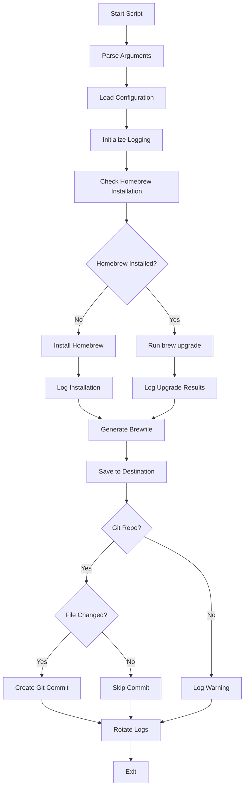

# Design Document

## Overview

The Homebrew configuration management system consists of a main bash script that orchestrates Homebrew installation, upgrades, and Brewfile management. The design emphasizes simplicity, reliability, and minimal dependencies to support execution on fresh macOS installations. The system includes logging with rotation, Git integration, and optional scheduled execution via launchd.

## Architecture

### Component Structure

```
homebrew-config/
├── brew-config.sh              # Main configuration script
├── install.sh                  # Installation script
├── config.sh.example           # Example configuration file
├── .gitignore                  # Git ignore rules
└── README.md                   # Documentation
```

### Execution Flow



## Components and Interfaces

### 1. Main Script (brew-config.sh)

The primary executable that orchestrates all operations.

**Functions:**

- `main()` - Entry point and orchestration (executes once and exits)
- `parse_arguments()` - Process command-line arguments
- `load_configuration()` - Read configuration from file or environment
- `check_homebrew()` - Verify Homebrew installation status
- `install_homebrew()` - Install Homebrew if missing
- `upgrade_homebrew()` - Run brew upgrade command
- `generate_brewfile()` - Create Brewfile from current configuration
- `save_brewfile()` - Write Brewfile to destination directory
- `commit_to_git()` - Create Git commit if applicable
- `generate_launchd_plist()` - Create launchd plist file for scheduling
- `setup_logging()` - Initialize log file and rotation
- `rotate_logs()` - Manage log file rotation
- `log_message()` - Write timestamped log entries
- `show_help()` - Display usage information

**Execution Model:**

The script follows a simple run-once model:

1. Parse arguments and load configuration
2. If --generate-plist flag is present, generate plist and exit
3. Otherwise, execute all operations in sequence
4. Exit with appropriate status code
5. No loops, timers, or background processes

**Command-line Interface:**

```bash
brew-config.sh [OPTIONS]

Options:
  -d, --destination DIR       Brewfile destination directory (default: ~/Config)
  -c, --config FILE           Configuration file path
  --generate-plist            Generate launchd plist file and exit
  --schedule-time HH:MM       Time for scheduled execution (default: 02:00)
  -h, --help                  Show help message
  -v, --version               Show version information
```

**Exit Codes:**

- 0: Success
- 1: Critical failure (Homebrew installation failed, Brewfile generation failed)
- 2: Configuration error
- 3: Permission error

### 2. Installation Script (install.sh)

Handles initial setup and installation of the script.

**Functions:**

- `install_script()` - Copy script to installation location
- `create_config()` - Generate configuration file from template
- `verify_installation()` - Validate installation success

**Installation Locations:**

- Script: `~/bin/brew-config.sh` (or user-specified)
- Config: `~/.config/homebrew-config/config.sh`
- Logs: `~/.local/share/homebrew-config/logs/`

**Note:** Scheduling setup (launchd plist or cron) is left to the user and documented in the README.

### 3. Configuration System

Configuration is loaded from multiple sources in order of precedence:

1. Command-line arguments (highest priority)
2. Configuration file specified with `-c`
3. Default configuration file at `~/.config/brew-automation/config.sh`
4. Environment variables
5. Built-in defaults (lowest priority)

**Configuration Parameters:**

```bash
# Brewfile destination directory
BREWFILE_DESTINATION="${HOME}/Config"

# Log directory
LOG_DIR="${HOME}/.local/share/homebrew-config/logs"

# Maximum log file size (bytes)
MAX_LOG_SIZE=10485760  # 10MB

# Number of rotated logs to keep
MAX_LOG_FILES=5

# Git commit enabled
GIT_COMMIT_ENABLED=true
```

### 4. Logging System

**Log Format:**

```
[YYYY-MM-DDTHH:MM:SS±TZ] [LEVEL] Message
```

**Log Levels:**

- INFO: Normal operations
- WARN: Non-critical issues
- ERROR: Failures that don't prevent continuation
- FATAL: Critical failures requiring exit

**Log Rotation Logic:**

1. Check current log file size before writing
2. If size exceeds MAX_LOG_SIZE:
   - Rename current log to `brew-automation-YYYYMMDD-HHMMSS.log`
   - Create new log file
   - Delete oldest rotated logs if count exceeds MAX_LOG_FILES

**Log Location:**

- Active log: `~/.local/share/homebrew-config/logs/homebrew-config.log`
- Rotated logs: `~/.local/share/homebrew-config/logs/homebrew-config-*.log`

### 5. Homebrew Integration

**Installation:**

Uses the official Homebrew installation script:

```bash
/bin/bash -c "$(curl -fsSL https://raw.githubusercontent.com/Homebrew/install/HEAD/install.sh)"
```

**Upgrade:**

```bash
brew upgrade
```

**Brewfile Generation:**

```bash
brew bundle dump --file="${DESTINATION}/Brewfile" --force
```

The `--force` flag ensures the Brewfile is overwritten if it exists.

### 6. Git Integration

**Git Operations:**

1. Check if destination directory is a Git repository:

   ```bash
   git -C "${DESTINATION}" rev-parse --git-dir
   ```

2. Check if Brewfile has changes:

   ```bash
   git -C "${DESTINATION}" diff --quiet Brewfile
   ```

3. Stage and commit Brewfile:
   ```bash
   git -C "${DESTINATION}" add Brewfile
   git -C "${DESTINATION}" commit -m "Update Brewfile - $(date -u +"%Y-%m-%dT%H:%M:%SZ")"
   ```

**Commit Message Format:**

```
Update Brewfile - YYYY-MM-DDTHH:MM:SSZ

Automated update from homebrew-config script
```

### 7. Scheduling Integration

The script is designed as a single-run command that completes and exits, making it compatible with any macOS scheduling mechanism.

**Plist Generation:**

The script includes a `--generate-plist` option that creates a launchd plist file:

```bash
brew-config.sh --generate-plist --schedule-time 02:00
```

This generates `~/Library/LaunchAgents/com.user.homebrew-config.plist`:

```xml
<?xml version="1.0" encoding="UTF-8"?>
<!DOCTYPE plist PUBLIC "-//Apple//DTD PLIST 1.0//EN" "http://www.apple.com/DTDs/PropertyList-1.0.dtd">
<plist version="1.0">
<dict>
    <key>Label</key>
    <string>com.user.homebrew-config</string>
    <key>ProgramArguments</key>
    <array>
        <string>/Users/username/bin/brew-config.sh</string>
    </array>
    <key>StartCalendarInterval</key>
    <dict>
        <key>Hour</key>
        <integer>2</integer>
        <key>Minute</key>
        <integer>0</integer>
    </dict>
    <key>StandardOutPath</key>
    <string>/Users/username/.local/share/homebrew-config/logs/launchd-stdout.log</string>
    <key>StandardErrorPath</key>
    <string>/Users/username/.local/share/homebrew-config/logs/launchd-stderr.log</string>
</dict>
</plist>
```

After generation, the script provides instructions for loading:

```bash
launchctl load ~/Library/LaunchAgents/com.user.homebrew-config.plist
```

**Alternative: Manual cron Entry:**

Users can also use cron:

```
0 2 * * * /Users/username/bin/brew-config.sh >> /Users/username/.local/share/homebrew-config/logs/cron.log 2>&1
```

**Script Behavior:**

- Script executes all operations in sequence
- Script exits immediately upon completion
- No loops, sleeps, or timing mechanisms in the script
- Suitable for any external scheduler

## Data Models

### Configuration Object

```bash
# Represented as bash variables
BREWFILE_DESTINATION=""
LOG_DIR=""
MAX_LOG_SIZE=""
MAX_LOG_FILES=""
GIT_COMMIT_ENABLED=""
SCRIPT_VERSION="1.0.0"
```

### Log Entry

```
Timestamp: ISO 8601 format with timezone
Level: INFO|WARN|ERROR|FATAL
Message: Free-form text
```

### Execution Context

```bash
# Runtime state
START_TIME=""           # Execution start timestamp
HOMEBREW_INSTALLED=""   # true|false
UPGRADE_SUCCESS=""      # true|false
BREWFILE_GENERATED=""   # true|false
GIT_COMMIT_CREATED=""   # true|false
```

## Error Handling

### Error Categories

1. **Critical Errors** (exit immediately):

   - Homebrew installation failure
   - Brewfile generation failure
   - Invalid configuration preventing execution
   - Permission errors for required directories

2. **Non-Critical Errors** (log and continue):
   - Homebrew upgrade failure
   - Git commit failure
   - Log rotation failure

### Error Handling Strategy

```bash
# Critical error example
if ! install_homebrew; then
    log_message "FATAL" "Failed to install Homebrew"
    exit 1
fi

# Non-critical error example
if ! upgrade_homebrew; then
    log_message "ERROR" "Homebrew upgrade failed, continuing with Brewfile generation"
fi
```

### Validation Checks

1. **Pre-execution:**

   - Verify macOS operating system
   - Check write permissions for destination directory
   - Validate configuration parameters
   - Ensure log directory is writable

2. **During execution:**

   - Verify command exit codes
   - Check file existence after creation
   - Validate Git repository status before commit

3. **Post-execution:**
   - Verify Brewfile was created
   - Confirm log entries were written
   - Validate exit code matches execution result

## Testing Strategy

### Unit Testing

Test individual functions in isolation:

1. **Configuration Loading:**

   - Test default values
   - Test configuration file parsing
   - Test command-line argument precedence
   - Test environment variable handling

2. **Logging:**

   - Test log message formatting
   - Test log rotation trigger
   - Test log file creation
   - Test old log deletion

3. **Path Handling:**
   - Test tilde expansion
   - Test environment variable expansion
   - Test directory creation
   - Test permission validation

### Integration Testing

Test component interactions:

1. **Homebrew Installation Flow:**

   - Test detection of existing Homebrew
   - Test installation on clean system
   - Test upgrade execution
   - Test error handling for failed operations

2. **Brewfile Generation:**

   - Test Brewfile creation
   - Test file saving to destination
   - Test overwriting existing Brewfile
   - Test handling of missing destination directory

3. **Git Integration:**

   - Test repository detection
   - Test change detection
   - Test commit creation
   - Test handling of non-repository destination

4. **Scheduled Execution:**
   - Test launchd plist generation
   - Test plist loading
   - Test scheduled execution trigger
   - Test manual execution alongside scheduled runs

### Manual Testing Scenarios

1. **Fresh Installation:**

   - Run on macOS system without Homebrew
   - Verify all components install correctly
   - Verify scheduled execution works

2. **Existing Homebrew:**

   - Run on system with Homebrew installed
   - Verify upgrade executes
   - Verify Brewfile reflects current state

3. **Configuration Variations:**

   - Test with custom destination directory
   - Test with different schedule patterns
   - Test with Git and non-Git destinations

4. **Error Conditions:**
   - Test with read-only destination
   - Test with invalid configuration
   - Test with network unavailable (for Homebrew install)

### Test Execution

Tests will be implemented as bash scripts in a `tests/` directory:

```
tests/
├── test-config.sh
├── test-logging.sh
├── test-homebrew.sh
├── test-brewfile.sh
├── test-git.sh
└── run-all-tests.sh
```

Each test script will:

- Set up test environment
- Execute test cases
- Report pass/fail results
- Clean up test artifacts

## Security Considerations

1. **Script Permissions:**

   - Main script should be executable only by owner
   - Configuration file should be readable only by owner
   - Log directory should be writable only by owner

2. **Input Validation:**

   - Sanitize all user-provided paths
   - Validate configuration values before use
   - Prevent command injection through arguments

3. **Credential Handling:**

   - No credentials stored in script or configuration
   - Rely on system Git configuration for authentication
   - Use system keychain for Homebrew authentication if needed

4. **Network Operations:**
   - Use HTTPS for Homebrew installation
   - Verify SSL certificates
   - Handle network failures gracefully

## Performance Considerations

1. **Execution Time:**

   - Homebrew upgrade can take several minutes
   - Brewfile generation is typically fast (< 1 second)
   - Git operations are fast for single file commits

2. **Resource Usage:**

   - Minimal CPU usage except during Homebrew operations
   - Log files capped at 10MB with rotation
   - Brewfile size typically < 100KB

3. **Optimization:**
   - Skip operations when not needed (e.g., no commit if file unchanged)
   - Use efficient bash constructs
   - Minimize subprocess creation

## Deployment

### Installation Process

1. Clone or download repository
2. Run `install.sh` with desired options
3. Edit configuration file if needed
4. Test manual execution
5. Set up scheduled execution if desired

### Uninstallation

1. Unload launchd job: `launchctl unload ~/Library/LaunchAgents/com.user.homebrew-config.plist`
2. Remove installed files:
   - Script: `~/bin/brew-config.sh`
   - Config: `~/.config/homebrew-config/`
   - Logs: `~/.local/share/homebrew-config/`
   - Plist: `~/Library/LaunchAgents/com.user.homebrew-config.plist`

### Updates

1. Download new version
2. Run `install.sh` to overwrite existing installation
3. Review configuration for new options
4. Restart launchd job if running

## Documentation Structure

### README.md Sections

1. **Overview** - What the script does
2. **Prerequisites** - System requirements
3. **Installation** - Step-by-step setup
4. **Configuration** - All configuration options
5. **Usage** - Command-line examples
6. **Scheduling** - Examples for setting up launchd or cron (user-managed)
7. **Logs** - Understanding log output
8. **Troubleshooting** - Common issues and solutions
9. **Uninstallation** - How to remove
10. **Development** - Contributing and testing

### Inline Documentation

- Function headers with description and parameters
- Complex logic explained with comments
- Configuration options documented in example file
- Error messages include actionable guidance
